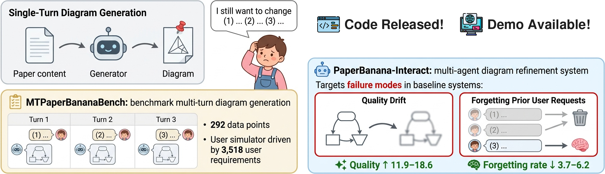
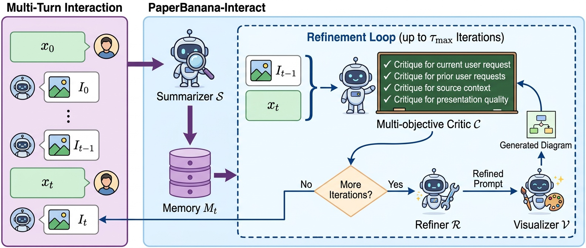
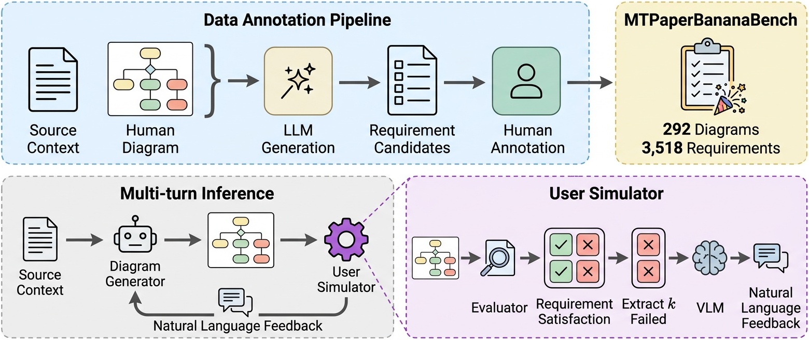

# <div align="center">⭐&nbsp;&nbsp;PaperBanana-Interact&nbsp;&nbsp;⭐</div>
<div align="center">Xueqing Wu, Ashwin Balasubramanian, Dawei Zhu, Bingxuan Li, Kai-Wei Chang, Yale Song, Yiwen Song, Rui Meng, Nanyun Peng
<br><br>

<a href="https://arxiv.org/abs/2608.30241"></a>
<a href="https://huggingface.co/spaces/xqwu/pb-interact-demo"></a>
<a href="https://huggingface.co/datasets/xqwu/MTPaperBananaBench"></a>
<a href="https://github.com/shirley-wu/PaperBanana-Interact"></a>
<br><br></div>



This repository contains **PaperBanana-Interact**, a multi-agent system that turns scientific diagram generation into an iterative authoring workflow. Given an initial diagram and multi-turn user feedback, PaperBanana-Interact maintains a compact memory of the interaction and runs an internal critique-and-refine loop that checks each revision against the latest request, all prior requests, faithfulness to the source paper, and presentation quality.

This is **not** an officially supported Google product. This project is not eligible for the Google Open Source Software Vulnerability Rewards Program.

The repository also supports experiments with **MTPaperBananaBench**, a benchmark for evaluating diagram refinement through multi-turn feedback.

## Table of Contents

- [Overview of PaperBanana-Interact](#overview-of-paperbanana-interact)
  - [Architecture](#architecture)
  - [Dataset](#dataset)
- [Setup Instructions](#setup-instructions)
  - [Clone the Repository](#clone-the-repository)
  - [Install Dependencies](#install-dependencies)
  - [Configure Models and API Keys](#configure-models-and-api-keys)
  - [Download the Dataset](#download-the-dataset)
- [Launch PaperBanana-Interact](#launch-paperbanana-interact)
  - [Interactive Web Demo](#1-interactive-web-demo)
  - [Benchmark Experiments](#2-benchmark-experiments)
  - [Results Visualization](#3-results-visualization)
- [Project Structure](#project-structure)
- [Citation](#citation)

## Overview of PaperBanana-Interact

Scientific diagrams are rarely finished in one pass. Authors often discover how a figure should be presented only after seeing an initial draft, making iterative refinement an essential part of the authoring process. In our formative study with 14 researchers, every participant requested revisions after viewing the initial draft, and 86% rated the refined diagram higher.

**PaperBanana-Interact** brings this workflow to automated diagram generation. Building on [PaperBanana](https://github.com/dwzhu-pku/PaperBanana) for the initial draft, it refines the diagram through multi-turn user feedback: at each turn, it summarizes the interaction history into a compact memory and coordinates a critic, refiner, and visualizer to incorporate the latest request while preserving prior edits and overall diagram quality.

To benchmark this setting, we introduce **MTPaperBananaBench**, which contains 292 diagrams and 3,518 annotated user requirements, revealed progressively by a user simulator over multiple turns. Evaluating existing refiners on it exposes two recurring failure modes: *quality drift*, where diagrams degrade over successive edits, and *forgetting*, where later edits undo previously satisfied requests. PaperBanana-Interact consistently improves rather than degrades diagrams across turns, outperforming baseline refiners by 11.9–18.6 quality points while reducing forgetting by 3.7–6.2 points.

### Architecture



**PaperBanana-Interact** is a multi-agent refinement system that builds on the agentic design of PaperBanana. It first compresses the multi-image interaction history into a compact textual memory, then runs an internal critic-refiner loop to iteratively improve both the image-generation prompt and the rendered diagram:

- **Summarizer:** Distills previous diagrams and user feedback into a shared textual memory describing each diagram, its changes, and whether they addressed the corresponding request.
- **Multi-objective Critic:** Evaluates the diagram against every constraint in parallel (the latest request, each prior request, source faithfulness, and presentation quality) and returns a separate verdict for each, so a new edit can't silently sacrifice an earlier one or overall quality.
- **Refiner:** Uses the critique and interaction context to update the image-generation prompt.
- **Visualizer:** Renders the updated prompt into a new diagram and returns it to the critic for another inspection.

The refinement loop runs for a budget of $\tau_{\max}$ iterations, or stops earlier if the critic determines that no further edits are required.

### Dataset



**MTPaperBananaBench** is the first benchmark for multi-turn scientific diagram generation and refinement. Built from the 292 examples in PaperBananaBench, it derives a hidden list of visualization requirements for each source context from the original author-drawn diagram, yielding **3,518 requirements** in total (about 12 per diagram).

- **Requirement Annotation:** Requirements are grounded in the source context and original author-drawn diagram, covering content, organization, and visual representation at different levels of severity.
- **User Simulator:** At each turn, an evaluator identifies unsatisfied requirements and the simulator converts the first $k$ into natural-language feedback; requirements remain hidden until surfaced.
- **Evaluation:** Reports requirement satisfaction, reference-based diagram quality, per-turn requirement satisfaction, and forgetting rate.

This controlled setup reveals two failure modes that single-turn evaluation misses: **quality drift**, where diagram quality progressively declines across turns, and **forgetting**, where later refinements overwrite previously satisfied requests.

## Setup Instructions

### Clone the Repository

```bash
git clone git@github.com:shirley-wu/PaperBanana-Interact.git
cd PaperBanana-Interact
```

### Install Dependencies

We recommend using `uv` or Conda to create an isolated Python 3.12 environment.

With [`uv`](https://docs.astral.sh/uv/getting-started/installation/):
```bash
uv venv --python 3.12
source .venv/bin/activate
uv pip install -r requirements.txt
```

With Conda:
```bash
conda create -n pb_interact -y python=3.12
conda activate pb_interact
python -m pip install -r requirements.txt
```

### Configure Models and API Keys

To keep your model settings and API keys in a local configuration file, copy `configs/model_config.template.yaml` to `configs/model_config.yaml` and update the values. The local configuration file is ignored by Git.

Alternatively, set the API keys through environment variables. You only need to set keys for the providers you use:
```bash
export GOOGLE_API_KEY="your_google_api_key"
export ANTHROPIC_API_KEY="your_anthropic_api_key"
export OPENAI_API_KEY="your_openai_api_key"
```

### Download the Dataset

MTPaperBananaBench provides both the test examples for benchmarking and the reference diagrams for retrieval. Clone it into `data/MTPaperBananaBench`:
```bash
mkdir -p data
git clone git@hf.co:datasets/xqwu/MTPaperBananaBench data/MTPaperBananaBench
```

The interactive demo will also function without the dataset, but the Retriever will then have no reference diagrams available.

## Launch PaperBanana-Interact

### 1. Interactive Web Demo

**Try it online (no local setup required):**  
👉 **[PaperBanana on Hugging Face Spaces](https://huggingface.co/spaces/xqwu/pb-interact-demo)**

To use the online demo, enter your Google Gemini API key in the text box in the top-right corner of the interface.

You can also run the Gradio app locally:
```bash
python app.py
```

For local use, configure your model and API key in `configs/model_config.yaml`, set the `GOOGLE_API_KEY` environment variable as described in [Configure Models and API Keys](#configure-models-and-api-keys), or enter your API key in the app's top-right API key field just as you would in the online demo.

### 2. Benchmark Experiments

Run inference on MTPaperBananaBench:
```bash
# PaperBanana is used as the single-turn generator in each command below.

# Refine with PaperBanana-Interact
python main_multiturn.py --refiner pb_interact --refiner_internal_critic_rounds 10

# Refine with a generative model (Nano Banana Pro)
python main_multiturn.py --refiner generative

# Refine with PaperBanana-DirectRefine
python main_multiturn.py --refiner pb_directrefine
```

**Important options:**
- `--load_initial_result`: Path to a JSON file containing single-turn generation results, before any simulated feedback. Use this option to start with output from another single-turn generator, such as Crafter, or to apply multiple refiners to the same single-turn results.
- `--load_prior_results`: Path to an existing experiment directory containing numbered turn files (`0.json`, `1.json`, and so on). The script loads the available results and writes the resumed run to a new experiment directory. This option is mutually exclusive with `--load_initial_result`.
- `--feedback_turns`: Number of simulated feedback iterations after single-turn generation (default: `5`).
- `--refiner`: Refiner used for follow-up turns: `generative`, `pb_directrefine`, or `pb_interact` (default: `generative`).
- `--refiner_internal_critic_rounds`: Maximum number of internal refinement rounds per feedback turn for `pb_directrefine` and `pb_interact` (default: `1`). This is the $\tau_{max}$ parameter for PaperBanana-Interact. The `generative` refiner requires this value to be `1`.

**Additional Available Options:**
1. General arguments:
   - `--dataset_name`: Dataset to use (default: `MTPaperBananaBench`).
   - `--split_name`: Dataset split to use (default: `test`).
   - `--main_model_name`: Model used for text generation and reasoning (default: `gemini-3.1-pro-preview`).
   - `--image_gen_model_name`: Model used for image generation and generative refinement (default: `gemini-3-pro-image`).
   - `--concurrent_num`: Maximum number of concurrently processed examples and API calls (default: `64`).
2. PaperBanana single-turn generation arguments:
   - `--exp_mode`: PaperBanana experiment mode (default: `dev_full`; see below).
   - `--retrieval_setting`: Retrieval strategy: `auto`, `manual`, `random`, or `none` (default: `auto`).
   - `--max_critic_rounds`: Maximum number of critic rounds during single-turn generation (default: `3`).
3. Multi-turn user-simulation arguments:
   - `--user_model_name`: Model used to simulate user feedback (default: `gemini-3.1-pro-preview`).
   - `--n_surfaced_req_per_turn`: Number of unsatisfied requirements surfaced per feedback turn; this is $k$ in the paper (default: `1`). Values greater than `1` use the multi-requirement simulator; the paper evaluates $k=1$ and $k=3$.

**Experiment Modes for PaperBanana:**
- `vanilla`: Directly calling generative models without planning or refinement
- `dev_planner`: Retriever → Planner → Visualizer
- `dev_planner_stylist`: Retriever → Planner → Stylist → Visualizer
- `dev_planner_critic`: Retriever → Planner → Visualizer → Critic (multi-round)
- `dev_full`: Full pipeline with all agents
- `demo_planner_critic`: Demo mode (Retriever → Planner → Visualizer → Critic; no Stylist) without evaluation
- `demo_full`: Demo mode (full pipeline) without evaluation

### 3. Results Visualization

Visualize the results of a benchmark experiment with Streamlit:
```bash
streamlit run visualize/show_multi_turn.py
```

The app will be served at [http://localhost:8501](http://localhost:8501). In **Results Directory Path**, enter an experiment directory containing per-turn files (`0.json`, `1.json`, and so on).

For each example, the app shows the generated diagram after every selected feedback turn, the corresponding user request, and whether that request was satisfied. You can also inspect preference scores, evaluation summaries, and intermediate generation stages.

## Project Structure

```
├── agents/
│   ├── __init__.py
│   ├── base_agent.py
│   ├── critic_agent.py
│   ├── planner_agent.py
│   ├── polish_agent.py
│   ├── refiner/
│   │   ├── __init__.py
│   │   ├── generative_refiner.py
│   │   ├── pb_directrefine.py
│   │   └── pb_interact.py
│   ├── retriever_agent.py
│   ├── stylist_agent.py
│   ├── vanilla_agent.py
│   └── visualizer_agent.py
├── assets/
│   └── ...                            # README and project-page figures
├── configs/
│   ├── model_config.template.yaml
│   └── model_config.yaml              # User-created; copy from the template
├── data/                              # User-added; download as described above
│   └── MTPaperBananaBench/
│       ├── images/
│       ├── ref.json
│       └── test.json
├── prompts/
│   ├── __init__.py
│   ├── diagram_eval_prompts.py
│   └── req_eval_prompts.py
├── style_guides/
│   ├── generate_category_style_guide.py
│   ├── neurips2025_diagram_style_guide.md
│   └── neurips2025_plot_style_guide.md
├── utils/
│   ├── __init__.py
│   ├── base64_rw_helper.py
│   ├── config.py
│   ├── eval_toolkits.py
│   ├── generation_utils.py
│   ├── image_utils.py
│   ├── paperviz_processor.py
│   ├── user_simulator.py
│   └── user_simulator_multi_req.py
├── visualize/
│   └── show_multi_turn.py
├── .gitignore
├── app.py                             # Interactive Gradio demo
├── index.html                         # Project webpage
├── main_multiturn.py                   # Benchmark experiments
├── requirements.txt
├── CONTRIBUTING.md
├── LICENSE
└── README.md
```

## Citation

If you find this repo helpful, please cite our paper as follows:
```bibtex
@misc{wu2026paperbananainteractscientificdiagramrefinement,
      title={PaperBanana-Interact: Scientific Diagram Refinement with Multi-Turn Human Feedback}, 
      author={Xueqing Wu and Ashwin Balasubramanian and Bingxuan Li and Dawei Zhu and Kai-Wei Chang and Yale Song and Yiwen Song and Rui Meng and Tomas Pfister and Nanyun Peng},
      year={2026},
      eprint={2608.30241},
      archivePrefix={arXiv},
      primaryClass={cs.CL},
      url={https://arxiv.org/abs/2608.30241}, 
}
```
